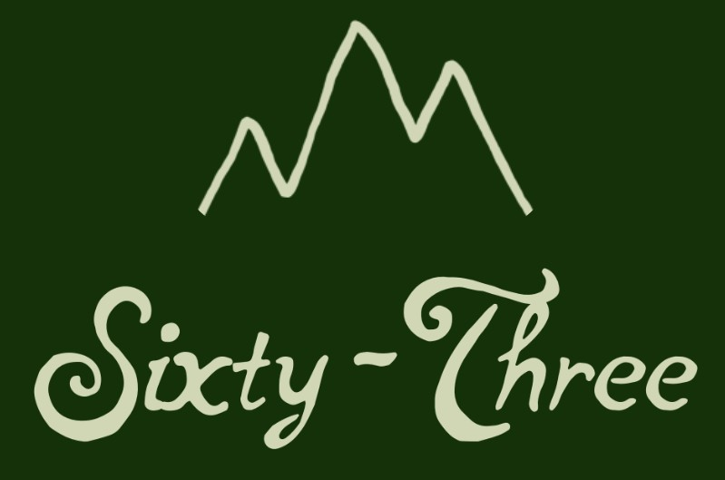

<div id="top"></div>
<!--
*** Thanks for checking out the Best-README-Template. If you have a suggestion
*** that would make this better, please fork the repo and create a pull request
*** or simply open an issue with the tag "enhancement".
*** Don't forget to give the project a star!
*** Thanks again! Now go create something AMAZING! :D
-->


<!-- PROJECT SHIELDS -->
<!--
*** I'm using markdown "reference style" links for readability.
*** Reference links are enclosed in brackets [ ] instead of parentheses ( ).
*** See the bottom of this document for the declaration of the reference variables
*** for contributors-url, forks-url, etc. This is an optional, concise syntax you may use.
*** https://www.markdownguide.org/basic-syntax/#reference-style-links
-->
[![Contributors][contributors-shield]][contributors-url]
[![Forks][forks-shield]][forks-url]
[![Stargazers][stars-shield]][stars-url]
[![Issues][issues-shield]][issues-url]

<!-- PROJECT LOGO -->
<br />
<div align="center">
  <a href="https://github.com/sean3434/SixtyThree">
    
  </a>

<h3 align="center">Sixty-Three</h3>

  <p align="center">
    U.S. National Park tracker application that allows users to track which of the 63 National Parks they've been to, earn milestone badges associated with the parks, and make posts and reviews based on their experiences.
    <br />
    <a href="https://github.com/sean3434/SixtyThree"><strong>Explore the code »</strong></a>
    <br />
    <br />
    <a href="https://sixtythree.herokuapp.com/">View Demo</a>
    ·
    <a href="https://github.com/sean3434/SixtyThree/issues">Report Bug</a>
    ·
    <a href="https://github.com/sean3434/SixtyThree/issues">Request Feature</a>
  </p>
</div>


<!-- TABLE OF CONTENTS -->
<details>
  <summary>Table of Contents</summary>
  <ol>
    <li>
      <a href="#about-the-project">About The Project</a>
      <ul>
        <li><a href="#built-with">Built With</a></li>
      </ul>
    </li>
    <li>
      <a href="#getting-started">Getting Started</a>
      <ul>
        <li><a href="#prerequisites">Prerequisites</a></li>
        <li><a href="#installation">Installation</a></li>
      </ul>
    </li>
    <li><a href="#usage">Usage</a></li>
    <li><a href="#roadmap">Roadmap</a></li>
    <li><a href="#contributing">Contributing</a></li>
    <li><a href="#license">License</a></li>
    <li><a href="#contact">Contact</a></li>
    <li><a href="#acknowledgments">Acknowledgments</a></li>
  </ol>
</details>


<!-- ABOUT THE PROJECT -->
## About The Project

[![Product Name Screen Shot][product-screenshot]](public/images/screen_shot.png)

U.S. National Park tracker application that allows users to track which of the 63 National Parks they've been to, earn milestone badges associated with the parks, and make posts and reviews based on their experiences.

<p align="right">(<a href="#top">back to top</a>)</p>

### Built With

* [Express](https://expressjs.com/)
* [MongoDB](https://www.mongodb.com/)

<p align="right">(<a href="#top">back to top</a>)</p>

<!-- GETTING STARTED -->
## Getting Started

To get a local copy up and running follow these simple steps.

### Prerequisites

MongoDB or and Mongo DB Atlas repository must be configured, and an API key must be obtained for the National Parks API (this is free).

### Installation

1. Clone the repo
   ```sh
   git clone https://github.com/sean3434/SixtyThree.git
   ```
2. Install dependencies
```sh
   npm i
   ```
3. Configure your .env file with a Mongo DB URI, NPS API key, and a secret for use in signing sessions.

4. Run node
```sh
   node server.js
   ```

<p align="right">(<a href="#top">back to top</a>)</p>


<!-- USAGE EXAMPLES -->
## Usage

Once you sign up for an account, you can navigate to the Parks section to look at the details of individual parks. If you've been to the Park, you can add the Parks badge to your profile from the Park details page. You can also then leave a review of the park.

The Users section allows you to view other users profiles. This allows you to see the parks they have visited and reviews they've left.

<p align="right">(<a href="#top">back to top</a>)</p>

## ER Diagram
[![ER Diagram][er-diagram]](public/images/SixtyThree-ER-diagram.jpeg)

<!-- MARKDOWN LINKS & IMAGES -->
[er-diagram]: public/images/SixtyThree-ER-diagram.jpeg

## Wireframe


<!-- ROADMAP -->
### MVP Goals
* As a user, I want to be able to login and see my parks visited/badges and associated reviews on my profile page
* As a user, I want to be able to collect milestone badges and review parks that I have been to
* As a user, I want to be able to see all of the parks on one page, linked with their associated show pages that display park info and reviews
* As a user, I want to be able to view other user profiles

### Stretch Goals
* As a user, I want to be able to see an interactive map of all the parks with pins that lead to each individual park
* As a user, I want to be able to interact with and search for other users
* As a user, I want to be able to have a customizable profile picture
* As a user, I want to be able to see my favorite park and reflections/highlights on my profile page

See the [open issues](https://github.com/sean3434/SixtyThree/issues) for a full list of proposed features (and known issues).

<p align="right">(<a href="#top">back to top</a>)</p>


<!-- CONTRIBUTING -->
## Contributing

Contributions are what make the open source community such an amazing place to learn, inspire, and create. Any contributions you make are **greatly appreciated**.

If you have a suggestion that would make this better, please fork the repo and create a pull request. You can also simply open an issue with the tag "enhancement".
Don't forget to give the project a star! Thanks again!

1. Fork the Project
2. Create your Feature Branch (`git checkout -b feature/AmazingFeature`)
3. Commit your Changes (`git commit -m 'Add some AmazingFeature'`)
4. Push to the Branch (`git push origin feature/AmazingFeature`)
5. Open a Pull Request

<p align="right">(<a href="#top">back to top</a>)</p>

<!-- ACKNOWLEDGMENTS -->
## Acknowledgments

* [National Parks API](https://www.nps.gov/subjects/developer/api-documentation.htm)
* [Google Fonts](https://fonts.google.com/)
* [Best-README-Template](https://github.com/othneildrew/Best-README-Template)

<p align="right">(<a href="#top">back to top</a>)</p>

<!-- MARKDOWN LINKS & IMAGES -->
<!-- https://www.markdownguide.org/basic-syntax/#reference-style-links -->
[contributors-shield]: https://img.shields.io/github/contributors/sean3434/SixtyThree.svg?style=for-the-badge
[contributors-url]: https://github.com/sean3434/SixtyThree/graphs/contributors
[forks-shield]: https://img.shields.io/github/forks/sean3434/SixtyThree.svg?style=for-the-badge
[forks-url]: https://github.com/sean3434/SixtyThree/network/members
[stars-shield]: https://img.shields.io/github/stars/sean3434/SixtyThree.svg?style=for-the-badge
[stars-url]: https://github.com/sean3434/SixtyThree/stargazers
[issues-shield]: https://img.shields.io/github/issues/sean3434/SixtyThree.svg?style=for-the-badge
[issues-url]: https://github.com/sean3434/SixtyThree/issues
[product-screenshot]: public/images/screen_shot.png